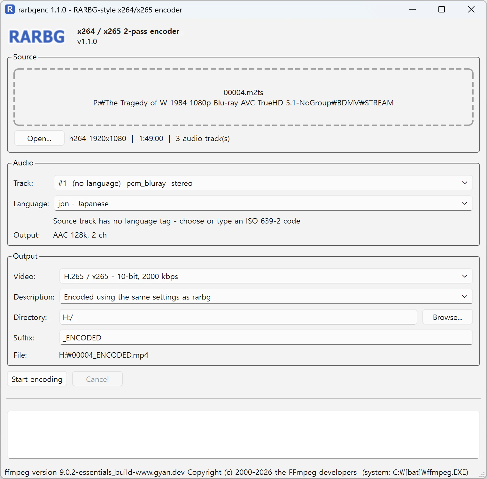

<p align="center"></p>

<h1 align="center">rarbgenc</h1>

[English](README.md) | **한국어**

RARBG가 블루레이 영상을 작은 용량으로 립할 때 사용하던 것과 동일한 2-pass 설정으로
x264 MP4 파일을 만드는 데스크톱 앱 (PySide6).



## 기능

- 파일 열기 대화상자 또는 드래그앤드랍으로 원본 동영상 입력
- 인코딩할 오디오 트랙 선택 (`ffprobe`로 전체 트랙 목록 표시)
- 오디오 언어 태그는 원본 트랙 값을 그대로 사용. 원본에 언어 정보가 없을 때만
  직접 선택/입력 가능 (ISO 639-2, 기본값 `eng`)
- MP4 `description` 메타데이터에 들어갈 짧은 디스크립션 작성
- 출력 디렉토리 (비우면 원본과 같은 폴더), 파일명 접미사 (기본값 `_ENCODED`) 지정
- 디스크립션 이력, 대체 언어, 출력 디렉토리, 접미사를 저장해 다음 실행 시 재사용
- pass 표시, 경과 시간, 남은 시간이 포함된 진행률 표시 및 언제든 취소 가능
- ffmpeg가 없으면 설치 방법을 안내하고, 버튼 한 번으로 앱 전용 정적 빌드 다운로드 가능

## 인코딩 설정

| | |
|---|---|
| 비디오 | `libx264`, 2-pass, `-b:v 2500k` |
| 1pass x264 파라미터 | `b-adapt=2:rc-lookahead=50` |
| 2pass x264 파라미터 | `me=umh:subme=9:me_range=24:ref=4:trellis=2:lookahead_threads=4:direct=auto:keyint_min=25:vbv_maxrate=31250:vbv_bufsize=31250:filler=0:psy_rd=1.00,0.15:aq-mode=3:deblock=-1,-1:chroma_qp_offset=0` |
| 오디오 (원본 6채널 이상, 5.1 / 7.1 등) | AAC 224k, 6채널 |
| 오디오 (원본 2~5채널) | AAC 128k, 2채널 (다운믹스) |
| 오디오 (원본 모노) | AAC 96k, 1채널 |
| 메타데이터 | `creation_time=now`, `title` / `comment` = 원본 파일명, `description` = 입력한 문구, 오디오 `language` = 원본(또는 선택한) 코드, 비디오 `language` 비움 |

첫 번째 비디오 스트림과 선택한 오디오 트랙만 기록하며 자막은 포함하지 않습니다.
pass 로그 파일은 임시 폴더에 만들어지고 인코딩이 끝나면 삭제됩니다.

## 요구 사항

- Python 3.13, [uv](https://docs.astral.sh/uv/)
- **libx264가 포함된** ffmpeg (아래 참고)

## 설치

```bash
git clone <this repository> rarbgenc
cd rarbgenc
uv tool install --editable .
```

`rarbgenc` 실행 파일이 설치됩니다 (예: `~/.local/bin/rarbgenc`). editable 설치이므로
소스를 수정하면 바로 반영됩니다.

제거: `uv tool uninstall rarbgenc`

## ffmpeg 설치

rarbgenc는 `PATH`에 있는 `ffmpeg` / `ffprobe`를 우선 사용합니다.

| OS | 명령 |
|---|---|
| Windows | `winget install --id Gyan.FFmpeg -e` (또는 `scoop install ffmpeg`, `choco install ffmpeg`) |
| macOS | `brew install ffmpeg` |
| Debian / Ubuntu | `sudo apt install ffmpeg` |
| Fedora | `sudo dnf install ffmpeg` (RPM Fusion) |
| Arch | `sudo pacman -S ffmpeg` |

설치 후에는 바뀐 `PATH`가 적용되도록 rarbgenc를 다시 실행하세요.

**원클릭 설치:** ffmpeg가 없거나 libx264 없이 빌드된 경우, 앱 상단의
**Download ffmpeg automatically** 버튼을 누르면 정적 빌드(약 100 MB,
[static-ffmpeg](https://github.com/zackees/static_ffmpeg) 사용)를 앱 데이터 폴더에 내려받아
rarbgenc 전용으로 사용합니다.

- Windows: `%LOCALAPPDATA%\rarbgenc\ffmpeg`
- macOS: `~/Library/Application Support/rarbgenc/ffmpeg`
- Linux: `~/.local/share/rarbgenc/ffmpeg`

## 사용법

```bash
rarbgenc                 # 창 열기
rarbgenc "movie.mkv"     # 파일을 미리 불러온 상태로 창 열기
```

1. 창에 동영상을 드래그앤드랍 (또는 **Open...** 클릭)
2. 오디오 트랙 선택. 원본 트랙에 언어 정보가 없을 때만 언어 지정
3. 필요하면 디스크립션, 출력 디렉토리, 접미사 수정
4. **Start encoding** 클릭

출력 파일: `<출력 디렉토리>/<원본 파일명><접미사>.mp4`

## 설정 파일

- Windows: `%APPDATA%\rarbgenc\settings.json`
- macOS: `~/Library/Application Support/rarbgenc/settings.json`
- Linux: `~/.config/rarbgenc/settings.json`

## 개발

```bash
uv sync
uv run rarbgenc
uv run pytest
```

통합 테스트와 GUI 테스트는 ffmpeg의 `lavfi` 소스로 짧은 샘플 영상을 만들어 실제 2-pass
인코딩을 수행합니다. libx264가 포함된 ffmpeg가 없으면 건너뜁니다.
GUI 테스트는 `QT_QPA_PLATFORM=offscreen`으로 실행됩니다.

## 프로젝트 구조

```
src/rarbgenc/
  encoder.py       2-pass 명령 생성, 오디오 프로파일, 진행률 파싱
  probe.py         ffprobe 래퍼
  languages.py     ISO 639-2 코드 및 정규화
  settings.py      사용자 설정 저장
  ffmpeg_tools.py  ffmpeg 탐색, 자동 다운로드, 설치 안내
  gui.py           PySide6 메인 창, QProcess 실행기
tests/
```
